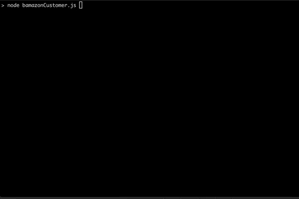
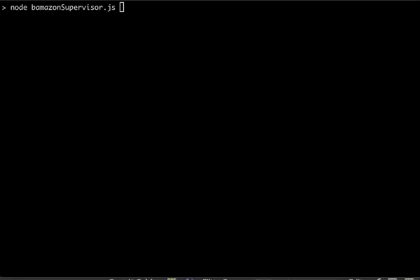

# bamazon

## Overview
Bamazon is a Amazon-like storefront in the terminal utilizing Node and MySQL. There are three scripts that perform different things. 
* bamazonCustomer.js - is a customer view where you can view and order products.
* bamazonManager.js - is a manager view for viewing and adding inventory.
* bamazonSupervisor.js - is a supervisor view for viewing and adding departments.

## How to use
Customer View
```sh
$ node bamazonCustomer.js
```


Manager View
```sh
$ node bamazonManager.js
```


Supervisor View
```sh
$ node bamazonSupervisor.js
```


### Technologies Used
* npm node modules:
    * mysql
    * inquirer
    * console-table-printer